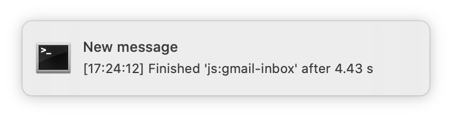

# custody-plugin-log-notifier

As developers, we wish that we got immediate feedback to our changes. Sometimes, we don't:

[](https://xkcd.com/303/)

This [custody] plugin can restore your focus by notifying you when your app logs certain messages. You
might use this to notify you when your build finishes, by watching for
`"Finished '<name of Gulp task>'"`.

You might also use this to notify you of certain high-priority logs, whenever they occur&mdash;kind
of like leaving a breakpoint in place, without actually having to [set up the debugger][debugger]
or stop what you're doing when the point is hit. By watching for `"^notify!"`, any log message you
prefix with that phrase will result in a notification.

Clicking the notification will then bring custody to the fore.

## Installation

```sh
npm install -g @custody/plugin-log-notifier
```

Make sure you also configure the plugin as in the next section.

Note that this only supports OS X [at the moment][Windows and Linux support].

## Usage

Launch `custody-cli settings` and add "@custody/plugin-log-notifier" to your
`.custodyrc`, with the patterns you'd like to watch. For the use cases described at the top of this
README, you might do something like

```json
{
  "plugins": [
    ["@custody/plugin-log-notifier", {
      "patterns": [
        "Finished 'js:gmail-inbox'",
        "^notify!"
      ]
    }]
  ]
}
```

The patterns are [parsed as] regular expressions.

Restart `custody-cli` to get it to pick up the new configuration. Repeat to make changes to the
patterns.

After opening a process' details in custody, if and when a log message matches one of the patterns,
it will then result in a notification:



> You will only receive a notification if a process logs a match while you have its details open.
If you'd like to support "background notifications" or notifications in the "maintail" view, please
open an issue!

Clicking the body of the notification, or the "Show" button that appears on hover, will bring
`Terminal.app` to the fore. If you use a different terminal app, specify it in custody settings
like so:

```json
{
  "plugins": [
    ["@custody/plugin-log-notifier", {
      "patterns": […],
      "terminal": "iTerm"
    }]
  ]
}
```

## Related Projects

Packages like [`gulp-notify`] can integrate directly into the build process, to detect precisely
when the build finishes, whereas this project reverse-engineers that sort of thing from the logs.

Some nice things about using this project are that:

* it works regardless of build technology
* you configure it once and it works across all the processes you have running in custody
* it can notify on messages logged by your services, not just their build processes:

  ```
  custody
    - gulp (using gulp-nodemon) <-- gulp-notify notifies here
      - node                    <-- this project can notify here too
  ```

Lastly, using this project, individual developers can easily configure notifications for themselves
without having to pass settings through to the build processes.

## Contributing

We welcome bug reports and feature suggestions! In particular, we'd love for
[Windows and Linux support].

[custody]: https://github.com/mixmaxhq/custody/
[debugger]: https://github.com/mixmaxhq/custody-plugin-start-debugger
[parsed as]: https://developer.mozilla.org/en-US/docs/Web/JavaScript/Reference/Global_Objects/Regexp
[`gulp-notify`]: https://www.npmjs.com/package/gulp-notify
[Windows and Linux support]: https://github.com/mixmaxhq/custody-plugin-log-notifier/issues/2
